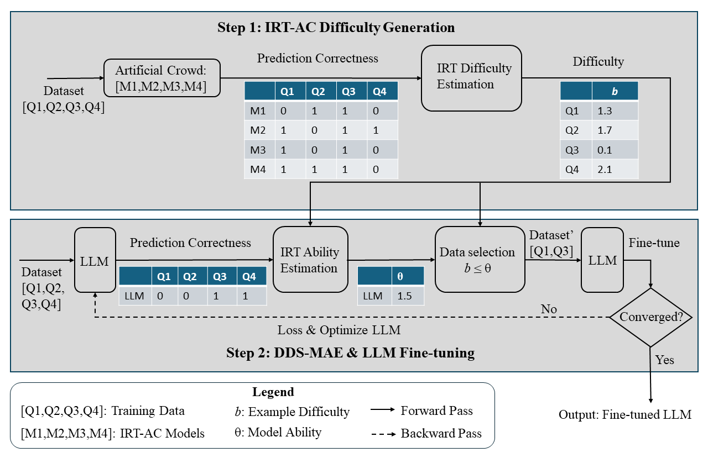

# PUDF: A Psychology-based Unified Dynamic Framework for Curriculum Learning

[](https://arxiv.org/abs/2408.05326)
[](https://opensource.org/licenses/MIT)
[](https://direct.mit.edu/coli)

Official implementation of **"A Psychology-based Unified Dynamic Framework for Curriculum Learning"**, accepted at *Computational Linguistics* journal.

## Overview

PUDF (A Psychology-based Unified Dynamic
Framework for Curriculum Learning) is a unified curriculum learning framework that combines:

- **IRT-AC (Item Response Theory with Artificial Crowd)**: Estimates example difficulty using an artificial crowd of language models and variational inference IRT
- **DDS-MAE (Dynamic Data Selection via Model Ability Estimation)**: Dynamically selects training examples based on the model's evolving ability

Unlike traditional curriculum learning methods that use fixed difficulty measures or schedules, PUDF adapts both difficulty estimation and data selection throughout training.

## Framework

<p align="center">
  
</p>

**Figure:** Workflow of PUDF. The process consists of two main steps: 1) IRT-AC for the Difficulty Measurement (DM), 2) DDS-MAE and LLM Fine-tuning for the Training Scheduler (TS).

## Installation

### Requirements

- Python 3.9+
- PyTorch 2.0+
- CUDA 12.1+ (for GPU training)

### Setup

```bash
# Clone the repository
git clone https://github.com/nd-ball/cl-irt.git
cd cl-irt

# Create conda environment
conda create -n pudf python=3.10
conda activate pudf

# Install dependencies
pip install -r requirements.txt

# For large models (Llama, Qwen), install bitsandbytes for QLoRA
pip install bitsandbytes>=0.41.0
```

### Environment Configuration

Each directory contains a `cl.env` file for HPC job submission. Update the HuggingFace cache path:

```bash
# In cl.env files, update this path to your own:
export HF_HOME="/path/to/your/huggingface_cache"
```

## Quick Start

### Training PUDF on GSM8K (Math Reasoning)

```bash
cd PUDF_gsm8k

# Option 1: Run directly
python llama3_1_8b_gsm8k_pudf.py \
  --model base \
  --total-epochs 10 \
  --pudf-epochs 8 \
  --lr 1e-4 \
  --lora-r 32 \
  --lora-alpha 64 \
  --train-batch-size 16 \
  --grad-accum-steps 4 \
  --seed 42

# Option 2: Submit as HPC job (SGE)
qsub pudf_llama.sh
```

### Training PUDF on GLUE

```bash
cd PUDF_GLUE

# Train DeBERTaV3 on all GLUE tasks
python PUDF_glue_DebertaV3.py

# Or submit as job
qsub glue_deberta.sh
```

## Repository Structure

```
cl-irt/
├── PUDF_GLUE/              # PUDF for GLUE benchmark (6 tasks)
│   ├── PUDF_glue_DebertaV3.py
│   ├── PUDF_glue_gpt2.py
│   ├── PUDF_Llama_8b.py
│   ├── PUDF_Qwen_7B.py
│   ├── build_features.py   # DDS-MAE implementation
│   └── irt_scoring.py      # IRT ability estimation
│
├── PUDF_MedQA/             # PUDF for medical QA
├── PUDF_ag_news/           # PUDF for AG News classification
├── PUDF_gsm8k/             # PUDF for math reasoning
│
├── baseline_*/             # Standard fine-tuning baselines
├── heuristic_*/            # Heuristic CL (sentence length, word rarity)
├── ablation_study/         # Ablation experiments (Table 5)
├── ablation_gsm8k/         # GSM8K ablations
│
├── gen_difficulty/         # IRT difficulty generation scripts
│   ├── GLUE_difficulty.py  # Generate GLUE difficulties
│   ├── MeD_QA/             # MedQA difficulty generation
│   └── merge_json.py       # Merge response patterns
│
├── gen_diff_gsm8k/         # GSM8K difficulty with 11 LLMs
│   ├── generate_irt_data.py
│   └── extract_irt_results.py
│
├── requirements.txt
└── README.md
```

## Core Components

### 1. IRT-AC: Difficulty Measurement (Section 4.2)

IRT-AC uses an **artificial crowd** of language models to estimate example difficulty:

1. **Fine-tune AC models** on validation data (0, 1, 3, 5, 10 epochs)
2. **Collect response patterns**: Run inference on training data
3. **Fit IRT model**: Use `py-irt` for variational inference

```python
# From irt_scoring.py
from scipy.optimize import minimize

def calculate_theta(difficulties, response_pattern, num_obs=-1):
    """Estimate model ability using MLE with Nelder-Mead optimization"""
    fn = theta_fn(difficulties, student_prior, response_pattern)
    result = minimize(fn, [0.1], method='Nelder-Mead')
    return result['x']
```

### 2. DDS-MAE: Dynamic Data Selection (Section 4.3-4.4)

DDS-MAE selects training examples based on the model's current ability:

```python
# From build_features.py - selecting examples within ability range
train_idx = [i for i in range(len(input_ids))
             if (theta_hat + lower_offset) <= difficulty[i] <= (theta_hat + upper_offset)]
```

**Key features:**
- Ability estimation via MLE (Nelder-Mead optimization)
- Dynamic threshold: increment θ by 0.1 if stagnant for 2 epochs
- Sampling 1000 examples for efficiency on large datasets
- Supports both easy-to-hard (`easiest`) and hard-to-easy (`hardest`) orderings

## Supported Models

| Model | Parameters | Method | Datasets |
|-------|------------|--------|----------|
| DeBERTaV3-base | 86M | Full fine-tuning | GLUE, MedQA, AG News |
| GPT-2 | 124M | Full fine-tuning | GLUE, MedQA, AG News |
| Llama-3.1-8B | 8B | QLoRA | All datasets |
| Qwen-2.5-7B | 7.6B | QLoRA | All datasets |

## Datasets

| Dataset | Task | Train Size | Labels |
|---------|------|------------|--------|
| GLUE (6 tasks) | NLU | 3.3k - 353k | 2-3 |
| MedQA-USMLE | Medical QA | 9.2k | 4 |
| AG News | Classification | ~995k | 14 |
| GSM8K | Math Reasoning | 7.5k | Generation |

### Pre-computed Difficulty Values

Response patterns and IRT difficulties are available on HuggingFace:
- [nd-ball/response-patterns](https://huggingface.co/datasets/nd-ball/response-patterns)

## Reproducing Main Results (Table 4)

### GLUE Benchmark

```bash
# Baseline
cd baseline_GLUE && python baseline_GLUE_deberta.py

# Heuristic CL (sentence length, word rarity)
cd heuristic_GLUE && python debertav3.py

# PUDF (ours)
cd PUDF_GLUE && python PUDF_glue_DebertaV3.py
```

### Ablation Study (Table 5)

```bash
cd ablation_study

# Swap difficulty measures (use IRT scheduler with heuristic difficulties)
python qwen_glue_ablation.py --difficulty_measurer sentence_length --training_scheduler pudf_theta
python qwen_glue_ablation.py --difficulty_measurer word_rarity --training_scheduler pudf_theta

# Swap training schedulers (use heuristic schedulers with IRT difficulty)
python qwen_glue_ablation.py --difficulty_measurer pudf_irt --training_scheduler linear
python qwen_glue_ablation.py --difficulty_measurer pudf_irt --training_scheduler root
```

## Generating IRT Difficulties

To generate difficulties for a new dataset:

```bash
cd gen_difficulty

# 1. Fine-tune AC models and collect response patterns
python GLUE_difficulty.py

# 2. Merge response patterns
python merge_json.py

# 3. Run py-irt to fit IRT model
py-irt train 1pl response_patterns.jsonlines output_dir/

# 4. Extract difficulties
cd ../gen_diff_gsm8k
python extract_irt_results.py output_dir/ 1pl
```

## Citation

If you use this code, please cite our paper:

```bibtex
@article{meng2024psychology,
  title={A Psychology-based Unified Dynamic Framework for Curriculum Learning},
  author={Meng, Guangyu and Zeng, Qinkai and Lalor, John P. and Yu, Hong},
  journal={Computational Linguistics},
  year={2024},
  publisher={MIT Press},
  url={https://arxiv.org/abs/2408.05326}
}
```

## License

This project is licensed under the MIT License - see the [LICENSE](LICENSE) file for details.

## Acknowledgments

- [py-irt](https://github.com/nd-ball/py-irt) for variational inference IRT
- HuggingFace Transformers and PEFT for model training
- Notre Dame CRC for computing resources

## Contact

- Guangyu Meng (gmeng@nd.edu)
- John P. Lalor (john.lalor@nd.edu)
- Hong Yu (hong_yu@uml.edu)
